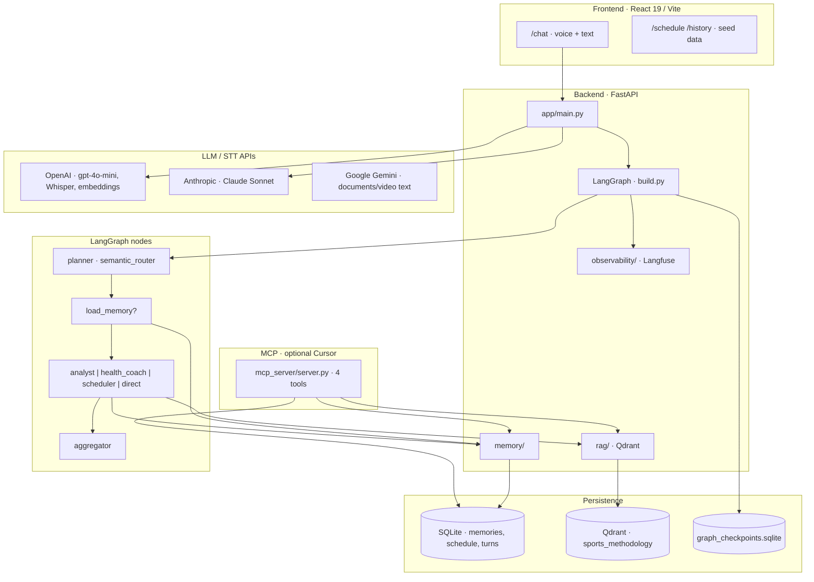
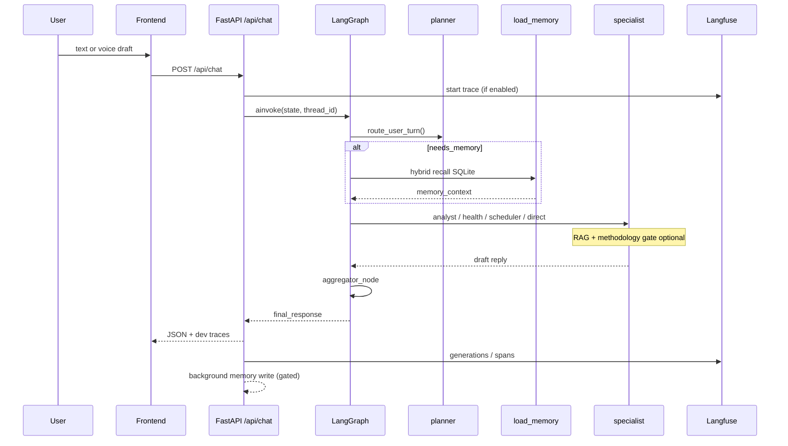
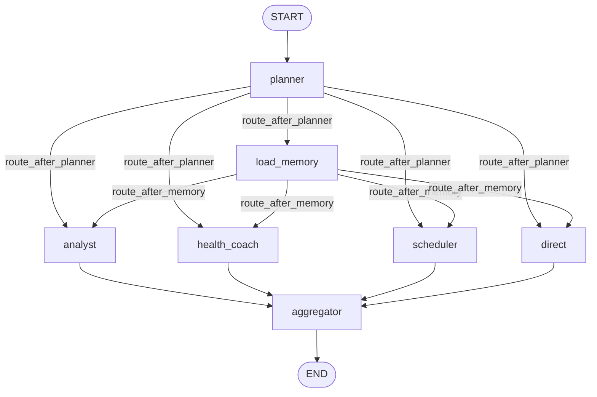
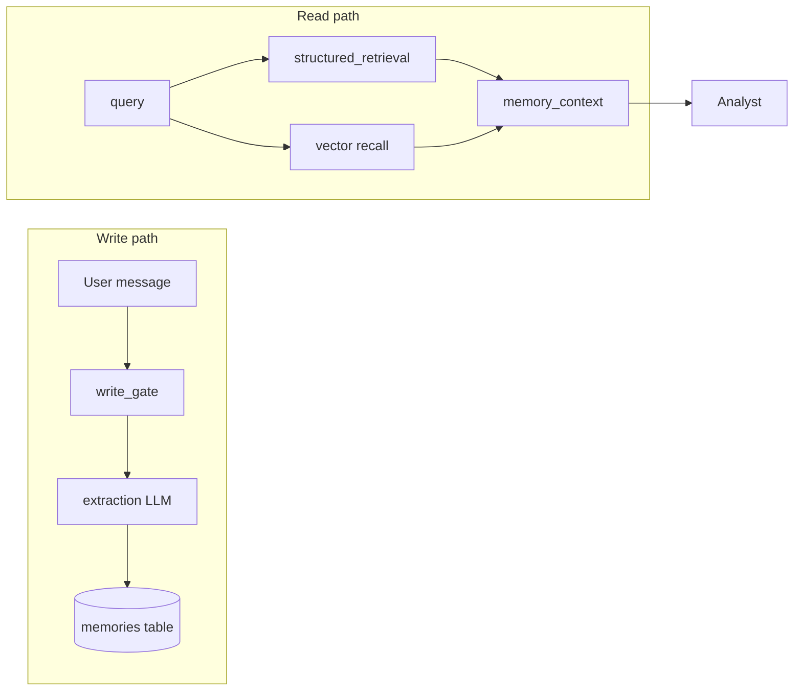
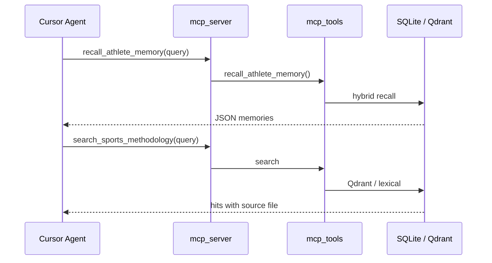
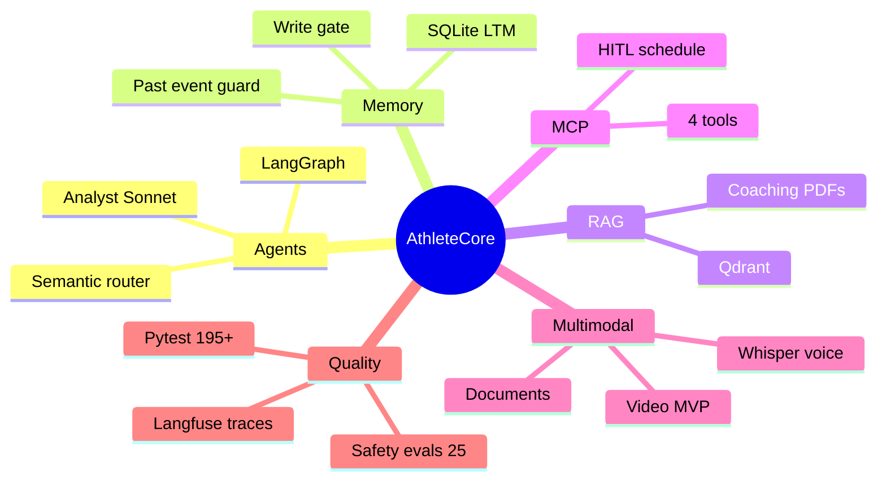

# AthleteCore — Architecture

Companion to [README.md](README.md) and [AthleteCore_TZ.md](AthleteCore_TZ.md).  
All diagrams use **Mermaid** (GitHub, VS Code preview, defense deck).

---

## 1. High-level architecture

**Separation of concerns**

| Layer | Question it answers |
|-------|---------------------|
| **LLM / semantic router** | What does the user want this turn? Which agent? Need memory? |
| **Backend guards** | Is past-event grounded? May we write memory? Is retrieval trusted? |

---

## 2. Request lifecycle

### Steps (one chat turn)

1. **Input** — Plain text from chat; voice via `POST /api/transcribe` (Whisper) first.
2. **Safety** — `turn_safety` checks (injection patterns, etc.) before graph.
3. **Planner** — `planner_node` calls `route_user_turn()` (semantic router, embeddings + rules).
4. **Branch** — `route_after_planner`: skip memory → specialist, or `load_memory` first.
5. **Memory read** — Hybrid recall (structured + vector) if `needs_memory=true`.
6. **Specialist** — One of Analyst / Health Coach / Scheduler / Direct runs with prompts + context tools.
7. **Aggregator** — Single user-facing message; strips analyst JSON fence from UI text.
8. **Post-turn** — Background extraction/write if `should_persist_memory` (write-gate).
9. **Trace** — `latency_trace` in dev; Langfuse spans/generations when `LANGFUSE_ENABLED=true`.

Code entry: `backend/app/graph/runner.py` · `backend/app/main.py` (`api_chat`).

---

## 3. LangGraph workflow

**Implementation:** `backend/app/graph/build.py`

### Nodes

| Node | Role |
|------|------|
| `planner` | Intent routing, `needs_memory`, agent selection (not a separate “supervisor LLM” — semantic router) |
| `load_memory` | LTM recall when required |
| `analyst` | Match/training analysis, comparison, past-event guard |
| `health_coach` | Recovery, load, wellbeing (same analyst model resolver) |
| `scheduler` | Calendar context + `PROPOSE:` HITL lines |
| `direct` | Small talk / general answers (`gpt-4o-mini`) |
| `aggregator` | Final response assembly |

### Why multi-agent (not one prompt)?

- **Different tools and context** — Analyst needs RAG + memory + JSON errors; Scheduler needs calendar; Direct should stay cheap.
- **Conditional memory** — Avoid retrieving LTM on weather or pure methodology questions (cost + noise).
- **Guardrails** — Past-event and anti-hallucination logic attach to Analyst path in code, not hope in one mega-prompt.
- **Model routing** — Sonnet for analysis, mini for router/direct (latency/cost trade-off).

Checkpointer: `AsyncSqliteSaver` on `GRAPH_CHECKPOINT_PATH` for thread continuity.

---

## 4. Agents

### Planner (semantic router)

| | |
|--|--|
| **Role** | Classify turn: agent, `needs_memory`, interaction mode |
| **Input** | `user_input`, thread metadata |
| **Output** | `AgentName`, flags for graph edges |
| **Code** | `backend/app/graph/semantic_router.py`, `planner_node` in `nodes.py` |
| **Failure modes** | Mis-route → wrong agent; mitigated by pytest + fast-path rules |

### Analyst

| | |
|--|--|
| **Role** | Root-cause analysis, match comparison, structured `errors[]` JSON |
| **Model** | `ANALYST_MODEL` (default Claude Sonnet) |
| **Input** | User message + memory + optional RAG + past-event resolution |
| **Output** | Prose + fenced JSON (stripped in UI) |
| **Failure modes** | Hallucinated past events → `past_event_guard` blocks LLM analysis; weak RAG → answer without book citations |

### Health Coach

| | |
|--|--|
| **Role** | Fatigue, recovery, training load tone |
| **Model** | Uses `resolve_analyst_model()` (same as Analyst) |
| **Note** | `health_model` in TZ is **not** a separate config field in current `config.py` |

### Scheduler

| | |
|--|--|
| **Role** | Read schedule context; emit `PROPOSE:` lines for HITL blocks |
| **Model** | Typically `gpt-4o-mini` via scheduler prompts |
| **Failure modes** | User must confirm `pending_confirmation` in DB — no auto-commit |

### Direct

| | |
|--|--|
| **Role** | General chat without heavy memory/RAG |
| **Model** | `PLANNER_MODEL` / mini |

### Aggregator

| | |
|--|--|
| **Role** | Normalize tone, interaction mode, follow-up offers |
| **Output** | `final_response` to API |

---

## 5. Memory layer

Summary — full detail: [MEMORY.md](MEMORY.md), [MEMORY_ARCHITECTURE.md](MEMORY_ARCHITECTURE.md).

**Stored:** facts, preferences, events, sport session types, `event_date`, `facts` JSON, embeddings, risk levels, supersession links.

**STM:** LangGraph checkpoint (thread messages), not a separate vector store.

---

## 6. RAG pipeline

| Stage | Implementation |
|-------|----------------|
| **Sources** | Parsed PDFs → `output/*.md` (local; LlamaParse via `scripts/parse_badminton_pdf.py`) |
| **Chunking** | `app/rag/chunking.py` — page markers, ~900 tokens, 120 overlap |
| **Embeddings** | OpenAI `text-embedding-3-small` |
| **Vector DB** | Qdrant collection `sports_methodology` |
| **Retrieval** | `app/rag/retrieve.py` + relevance filter |
| **Rerank** | Optional cross-encoder (`DISABLE_RERANKER=1` default off) |
| **Fallback** | Lexical search on `output/*.md` if Qdrant unavailable |
| **Injection** | Methodology gate in graph; MCP `search_sports_methodology` for Cursor |

Ingest: `scripts/ingest_methodology_qdrant.py --recreate`

---

## 7. MCP

See [MCP.md](MCP.md). Server: `mcp_server/server.py` — tools delegate to `backend/app/mcp_tools/`.

---

## 8. Custom Skill

Location: `.agents/skills/athletecore/SKILL.md`  
Doc: [SKILLS.md](SKILLS.md)

---

## 9. Observability

| System | Status |
|--------|--------|
| **Langfuse** | Implemented — `backend/app/observability/langfuse_tracing.py` |
| **latency_trace** | Dev JSON in API response when `DEVELOPMENT_MODE=true` |
| **LangSmith** | Not wired in backend |
| **Sentry** | Not in current backend code |

See [OBSERVABILITY.md](OBSERVABILITY.md), [docs/LANGFUSE_TRACING.md](docs/LANGFUSE_TRACING.md).

---

## 10. Evals

| Runner | Purpose |
|--------|---------|
| `app.evals.run_safety_eval` | 25-case hybrid safety golden dataset |
| `app.evals.run_chat_latency_benchmark` | Latency percentiles |
| `app.evals.run_video_debug` | Video player-selection debug artifacts |

See [EVALS.md](EVALS.md). No automated Analyst 40-case golden runner in repo.

---

## 11. Design decisions & trade-offs

| Decision | Choice | Trade-off |
|----------|--------|-----------|
| Orchestration | LangGraph | Learning curve vs explicit conditional graph |
| Analyst model | Claude Sonnet | Quality vs cost/latency |
| Router / Direct | GPT-4o-mini | Speed and cost vs depth |
| Memory store | SQLite + JSON embeddings | Simple deploy vs scale-out vector DB for LTM |
| Methodology | Qdrant + lexical fallback | Ops complexity vs recall reliability |
| MCP | stdio FastMCP | Great for Cursor; not HTTP-native for mobile app |
| Tracing | Langfuse | Course asks LangSmith — document Langfuse as implemented choice |
| HITL schedule | DB `pending_confirmation` | Safe but needs UI polish |

---

## 12. Failure modes & fallbacks

| Failure | Behavior |
|---------|----------|
| Hallucinated past match | `past_event_guard` → `not_found` template, `llm_called=false` |
| Weak RAG | Lower scores filtered; may answer without citations |
| Missing athlete context | Analyst uses only user message; may ask clarifying questions |
| Noisy Whisper | User edits draft before send |
| MCP / tool error | MCP returns error JSON; graph tools use in-process `mcp_tools` |
| Qdrant down | Lexical fallback if `METHODOLOGY_FALLBACK_LEXICAL=true` |
| Langfuse down | Chat continues; tracing no-op |

---

## 13. Presentation mindmap

---

## Related files

| Path | Topic |
|------|-------|
| `backend/app/graph/build.py` | Graph topology |
| `backend/app/graph/semantic_router.py` | Routing |
| `backend/app/memory/` | LTM |
| `backend/app/rag/` | Methodology RAG |
| `backend/app/config.py` | Models and feature flags |
| `PRODUCT_DECISION_LOG.md` | Product/engineering decisions |
