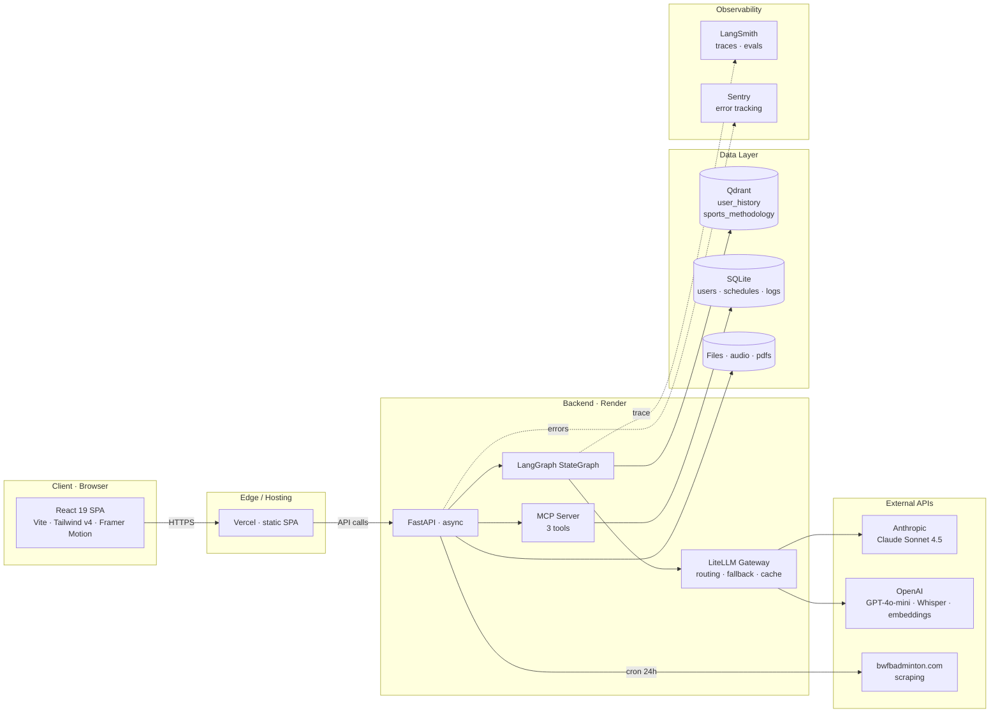
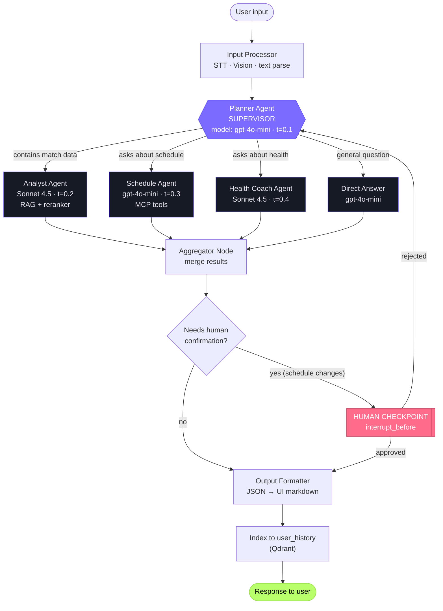
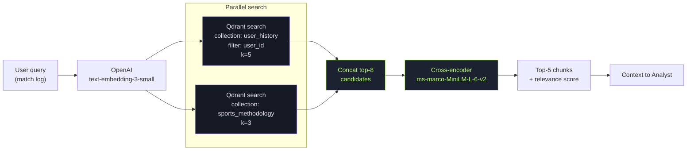
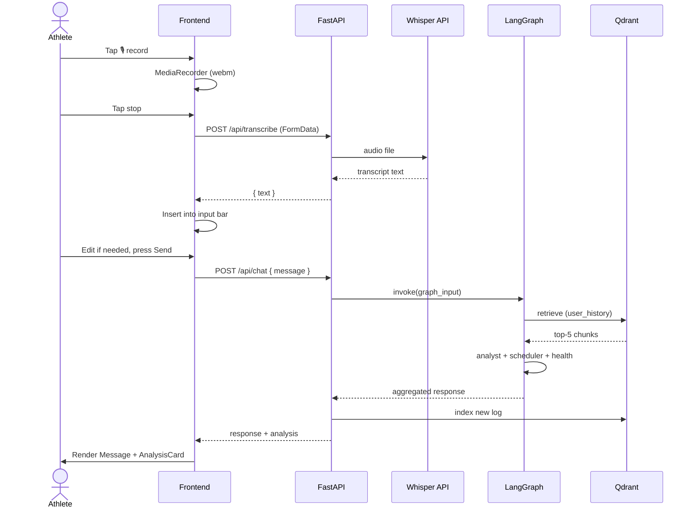
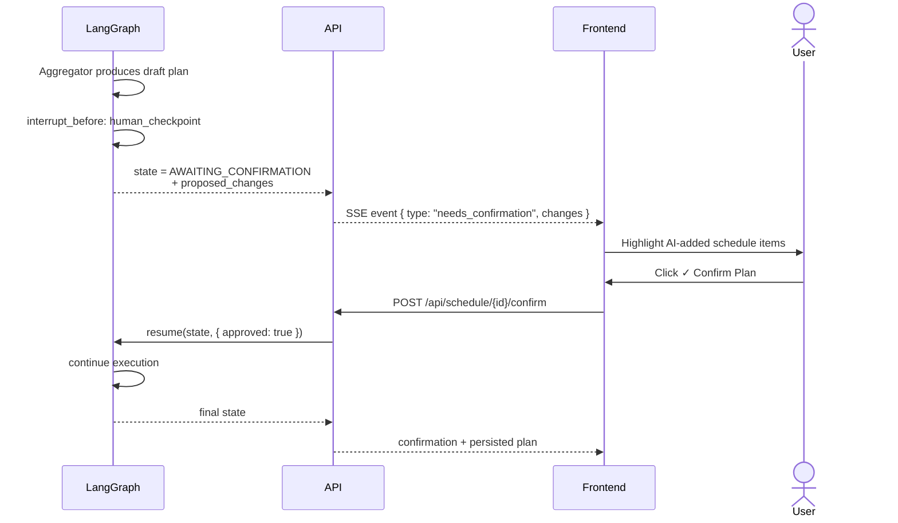
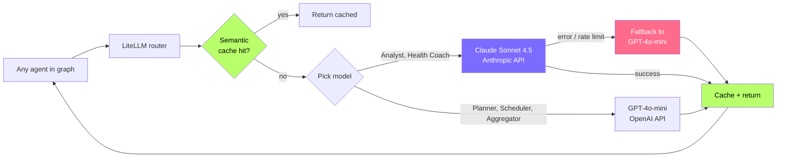
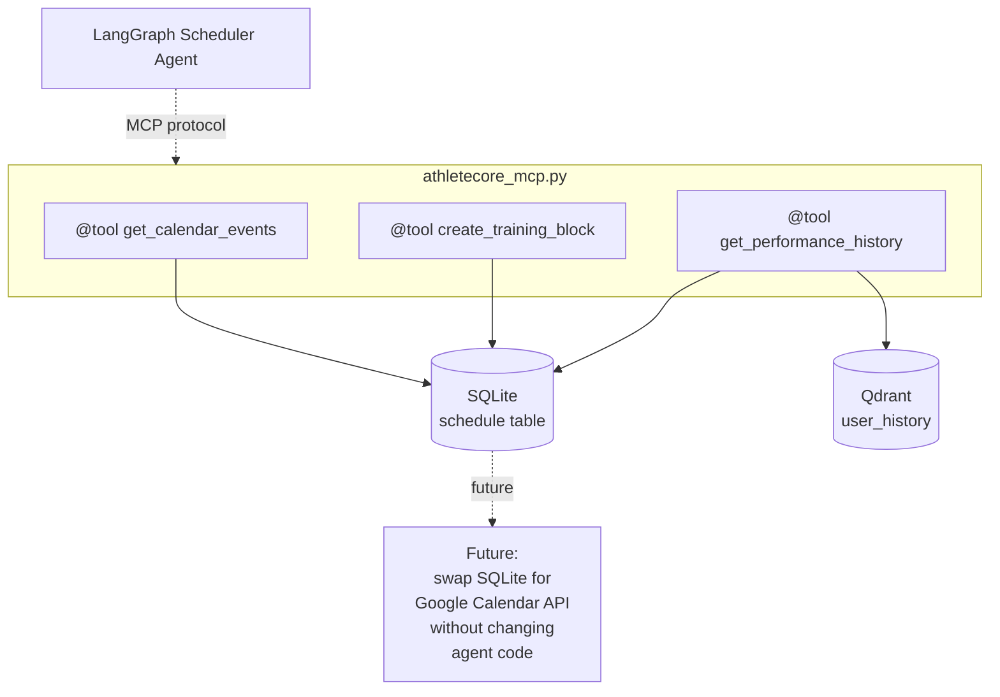
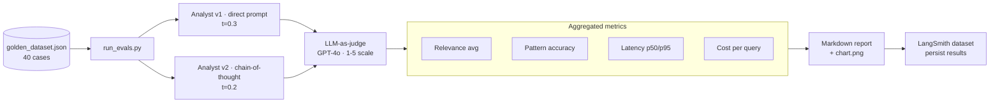
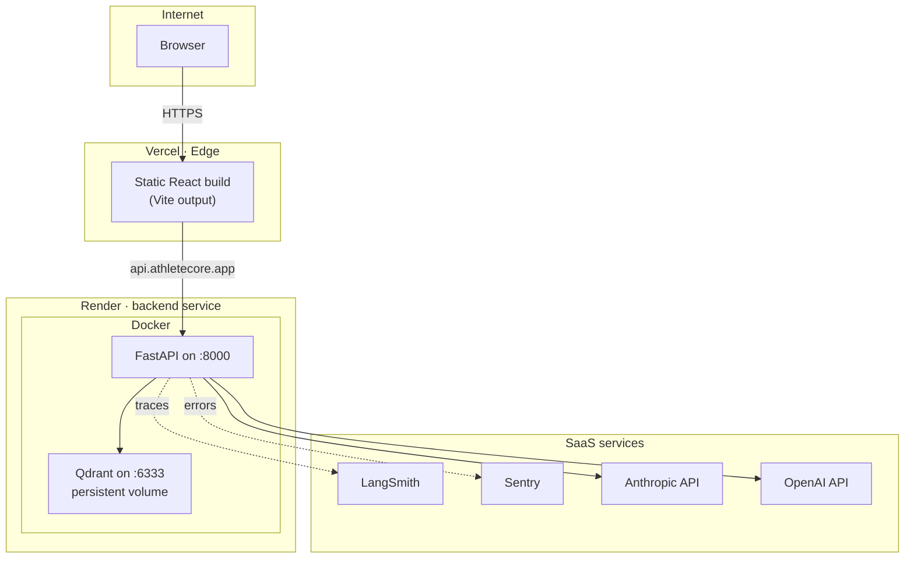
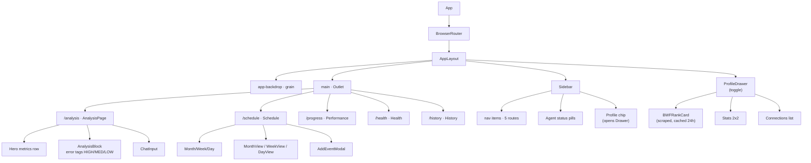

# AthleteCore — Архитектура

> Сопроводительный документ к `AthleteCore_TZ.md`.
> Все диаграммы — в Mermaid, рендерятся в GitHub, Notion, VS Code Markdown Preview.

---

## 1. Карта системы (high-level)



---

## 2. Поток агентов (LangGraph StateGraph)



---

## 3. RAG Pipeline (retrieval)



---

## 4. Voice logging (multimodal)



---

## 5. Human-in-the-loop checkpoint



---

## 6. Multi-model routing (LiteLLM)



---

## 7. MCP server topology



---

## 8. Evals & A/B pipeline



---

## 9. Deployment topology (Demo Days)



---

## 10. Frontend component tree (текущий skeleton)



---

## 11. State shape (LangGraph)

```python
class GraphState(TypedDict):
    # Input
    user_id: str
    raw_input: str            # transcribed text
    image_b64: str | None     # for Vision

    # Routing
    selected_agents: list[Literal["analyst", "scheduler", "health_coach"]]

    # Per-agent results
    analyst_output: AnalystResult | None
    scheduler_output: ScheduleResult | None
    health_output: HealthResult | None

    # Aggregation
    aggregated_response: str
    proposed_schedule_changes: list[ScheduleChange]

    # HITL
    awaiting_confirmation: bool
    user_decision: Literal["approve", "reject"] | None

    # Metadata
    trace_id: str
    started_at: datetime
    cost_usd: float
```

---

## 12. Цвета и легенда диаграмм

| Цвет | Что значит |
|---|---|
| 🟣 фиолетовый (`#7c6bff`) | Supervisor / основная логика |
| 🟢 лайм (`#b8ff6b`) | Успех / финал / cache |
| 🔴 коралл (`#ff6b8a`) | HITL / fallback / алерт |
| ⚫ тёмный (`#161a24`) | Сервис / специалист |
| 🟡 янтарь (`#ffc83c`) | Внимание / опционально |

---

## 13. Что НЕ нарисовано на диаграммах (намеренно)

- Authentication flow (на MVP — один юзер без auth)
- Rate limiting (через `slowapi` middleware — стандарт)
- Logging (через `structlog` → stdout → Render logs)
- Background jobs (нет в MVP — всё синхронно)

Эти вещи появятся в v0.3 (post Demo Days), когда продукт пойдёт в pilot с несколькими спортсменами.

---

*ARCHITECTURE.md — v0.2 · соответствует `AthleteCore_TZ.md` v0.2*
