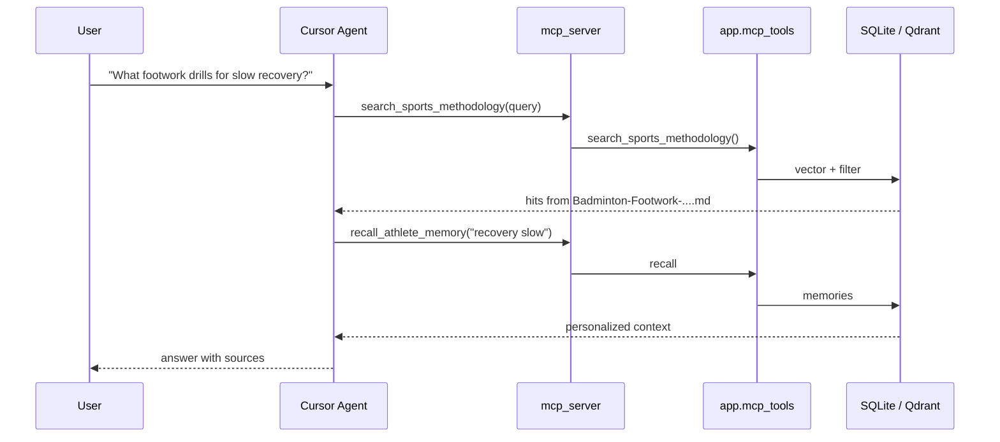

# AthleteCore — MCP (Model Context Protocol)

## 1. What MCP is in this project

[MCP](https://modelcontextprotocol.io/) exposes AthleteCore **domain actions** as tools any compatible client (Cursor, Claude Desktop) can call. The LLM reasons; MCP executes **memory recall**, **methodology search**, and **schedule** operations with stable JSON schemas.

This is separate from the in-process tools used inside LangGraph (`backend/app/mcp_tools/` is shared by both).

---

## 2. Why MCP instead of a normal API?

| Benefit | Explanation |
|---------|-------------|
| **Standard tool interface** | Same tool definitions for Cursor, agents, and future clients |
| **LLM-friendly** | Descriptions and JSON schemas tuned for tool selection |
| **Extension** | Add tools without changing chat UI |
| **Separation** | Reasoning (agent) vs actions (data layer) |

The FastAPI `/api/chat` path does **not** require MCP for end users — MCP is for **developer/agent** workflows and course requirements.

---

## 3. MCP server location

| Item | Path |
|------|------|
| Server entry | `mcp_server/server.py` |
| Tool implementations | `backend/app/mcp_tools/` |
| Cursor config | `.cursor/mcp.json` |
| README | `mcp_server/README.md` |

**Run manually** (project root):

```powershell
$env:PYTHONPATH="backend"
.\venv\Scripts\python.exe -m mcp_server.server
```

---

## 4. Tools

### 4.1 `recall_athlete_memory`

| | |
|--|--|
| **Purpose** | Hybrid long-term memory recall for the athlete |
| **Inputs** | `query` (required), `user_id`, `session_id`, `max_tokens` |
| **Output** | JSON: memories, citations, token estimate |
| **Use when** | Personalized analysis, patterns, past performance — **not** weather or generic facts |
| **Implementation** | `backend/app/mcp_tools/memory.py` |

### 4.2 `search_sports_methodology`

| | |
|--|--|
| **Purpose** | RAG over parsed coaching books (`output/*.md` → Qdrant) |
| **Inputs** | `query`, `top_k` (max 10) |
| **Output** | JSON: `hits[]` with text snippets and `source` filename |
| **Use when** | Footwork, strokes, drills — cite `source` in answers |
| **Implementation** | `backend/app/mcp_tools/methodology.py` |

### 4.3 `get_training_schedule`

| | |
|--|--|
| **Purpose** | List calendar blocks in a date range |
| **Inputs** | `user_id`, `date_from`, `date_to` (YYYY-MM-DD), `include_pending` |
| **Output** | JSON events from SQLite schedule |
| **Use when** | Before proposing changes — check conflicts and load |
| **Implementation** | `backend/app/mcp_tools/schedule.py` |

### 4.4 `propose_training_block`

| | |
|--|--|
| **Purpose** | Create **HITL** draft event (`pending_confirmation`) |
| **Inputs** | `title`, `event_date`, `start_time`, `end_time`, `event_type`, optional `notes` |
| **Output** | JSON with proposed event id / status |
| **Use when** | Athlete (or agent) drafts a new block — **requires confirmation** in app |
| **Why it matters** | Prevents silent calendar overwrites by AI |

---

## 5. How agents call MCP tools

**Inside LangGraph:** nodes call `mcp_tools` Python functions directly (same code as MCP server).

**Inside Cursor:** enable **athletecore** MCP → model selects tools from schemas in `server.py`.



---

## 6. Demo scenario (defense)

1. Open Cursor → Settings → MCP → **athletecore** enabled (`.cursor/mcp.json`).
2. Ask: *«Найди в методологии упражнения на footwork при медленном восстановлении»* → `search_sports_methodology`.
3. Ask: *«Что я писала про усталость на прошлой неделе?»* → `recall_athlete_memory`.
4. Ask: *«Покажи расписание на 14 дней»* → `get_training_schedule`.
5. Optional: *«Предложи восстановительную тренировку завтра 10:00–11:00»* → `propose_training_block` → show `pending_confirmation` in DB or schedule API.

Also demo in-product: chat does **not** need MCP — same `mcp_tools` power wired in graph.

---

## 7. Limitations and next steps

- MCP is **stdio** — not exposed as public HTTP for mobile clients.
- Live tools need backend DB + optional Qdrant running.
- Schedule **confirm/reject UI** in frontend is still limited (seed pages).
- Future: HTTP MCP gateway, OAuth, coach-role tools.

---

## References

- Skill tool table: `.agents/skills/athletecore/references/mcp-tools.md`
- [SKILLS.md](SKILLS.md)
