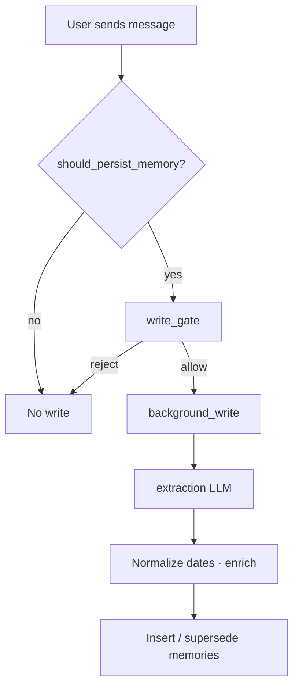

# AthleteCore — Memory Layer

Why memory exists, how it works in **this codebase**, and what it does **not** do yet.

Deep implementation reference: [MEMORY_ARCHITECTURE.md](MEMORY_ARCHITECTURE.md).

---

## 1. Why memory matters

A generic chatbot treats every session as isolated. For a professional athlete:

- Recurring technique errors (e.g. late backhand recovery) should influence the next analysis.
- Preferences (morning vs evening training, communication tone) should persist.
- Past matches and wellbeing notes must be **retrieved**, not invented.

AthleteCore stores **long-term memory (LTM)** in SQLite and recalls it only when the semantic router decides `needs_memory=true`.

---

## 2. Athlete Memory Layer — what we store

Based on `backend/app/memory/models.py` and extraction pipeline:

| Category | Representation |
|----------|----------------|
| **Goals / facts** | `memory_type=fact`, `key`/`value` text |
| **Preferences** | `memory_type=preference` |
| **Opinions** | `memory_type=opinion` |
| **Events / training** | `memory_type=event`, `event_date`, `session_type`, `facts` JSON |
| **Sport context** | `sport` (default badminton), `event_type`, `risk_level` |
| **Layers** | `memory_layer`: semantic, episodic, procedural |
| **Provenance** | `source_turn_id`, `raw_user_text`, `source` (chat, voice, document, video) |
| **Lifecycle** | `active`, `supersedes_id` for updates |

**Injuries / medical:** only if user states them in logs — system does **not** diagnose; Health Coach gives general training wellbeing guidance, not medical advice.

---

## 3. Memory schema (code)

Core table: `memories` (see `Memory` model).

```text
id, user_id, source_session, source_turn_id
memory_type, memory_layer, key, value
confidence, importance
event_type, risk_level, payload (JSON)
event_date, event_date_end, raw_user_text, source, sport, session_type
facts (JSON), schema_version
embedding (JSON array), supersedes_id, active
created_at, updated_at
```

Turns are stored in `turns` with full message JSON for audit and extraction.

---

## 4. Read flow

Memory is read when:

1. **LangGraph** — `load_memory_node` after planner sets `needs_memory=true`.
2. **Hybrid recall** — `MemoryContextService.recall()` combines structured filters + embedding similarity.
3. **Past-event questions** — `past_event_guard` / `structured_retrieval` before Analyst LLM (anti-hallucination).
4. **MCP** — `recall_athlete_memory` tool for Cursor agents.
5. **API** — `POST /recall` for debugging.

Memory is **skipped** for small talk, pure methodology lookup, or turns explicitly routed to `direct` without history need (see `needs_memory_for_decision` in semantic router).

---

## 5. Write / update flow



1. After response, `should_persist_memory()` (router + rules).
2. **Write-gate** blocks assistant-only or low-signal content.
3. **Background job** runs extraction (user facts only — not assistant hallucinations).
4. **Date normalizer** sets `event_date` in code, not LLM-freeform.
5. **Supersession** deactivates outdated facts when user corrects.

Code: `write_gate.py`, `background_write.py`, `extraction.py`, `supersession.py`.

---

## 6. Personalization examples (illustrative)

- User often logs **evening fatigue** after intensive sessions → future Health Coach turns see episodic memories and may suggest load management language (not medical diagnosis).
- Repeated **net kill errors** in match logs → Analyst gets semantic memories; comparison flow can reference patterns.
- User prefers **short, direct** coaching tone → `interaction` module adjusts phrasing when mode is set.

These depend on **actual stored memories** — empty DB means no personalization.

---

## 7. Short-term vs long-term

| Type | Mechanism |
|------|-----------|
| **STM (thread)** | LangGraph checkpoint SQLite — conversation within `thread_id` |
| **LTM** | `memories` table — cross-session for `user_id` |

Chat history in browser: `localStorage` on `/chat` only (frontend convenience, not server LTM).

---

## 8. Privacy & safety notes

- No production multi-tenant auth — demo `user_id` (e.g. `aigerim`).
- `MEMORY_AUTH_TOKEN` optional for memory API hardening.
- Write-gate reduces storing noise (weather, jokes).
- Past-event guard reduces **fabricated match history**.
- Langfuse verbose mode can log prompts — disable `LANGFUSE_TRACE_VERBOSE` for sensitive demos.

---

## 9. Limitations

- No federated sync across devices/users at scale.
- Embeddings stored in SQLite JSON — not a dedicated vector DB for LTM.
- No automatic conflict resolution for contradictory user statements beyond supersession rules.
- Memory quality depends on extraction LLM and user clarity.
- Video/document memories depend on pipeline quality (partial MVP).

---

## 10. Presentation-ready summary (slide bullets)

- **LTM in SQLite** with typed facts, events, and sport metadata — not just chat logs.
- **Conditional recall** — memory loads only when the router says it’s needed (cost + precision).
- **Write-gate + background extraction** — only user-grounded facts persist.
- **Past-event guard** — structured retrieval before Analyst to prevent invented matches.
- **MCP `recall_athlete_memory`** — same recall path for IDE agents and product logic.
