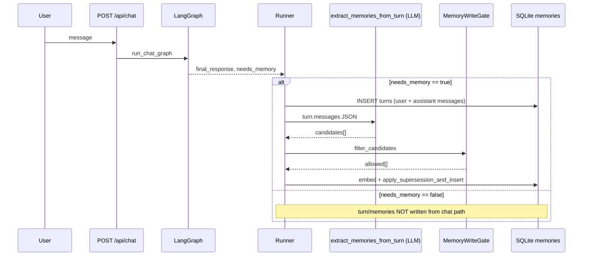
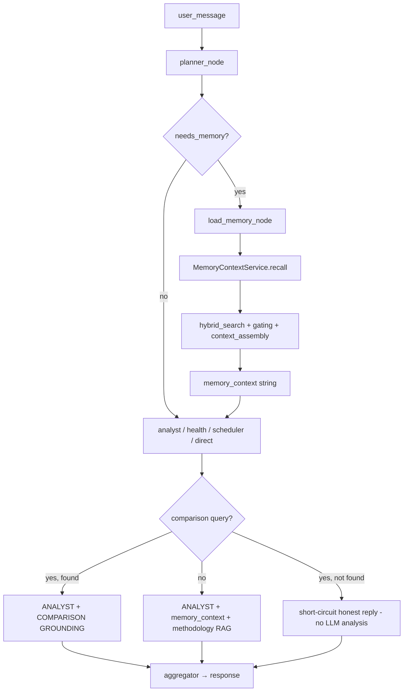

# AthleteCore Memory Architecture

> **Presentation summary:** see [MEMORY.md](MEMORY.md) · **Defense checklist:** [CHECKLIST.md](CHECKLIST.md)

> **Статус документа:** аудит исходного состояния (§1–11) + **реализованные исправления** (§13–14).  
> §1–8 описывают проблемы **до** structured memory v1; §13–14 — **текущее** поведение кода.

---

## Design principle

**LLM decides what the user means.**  
**Backend decides what is allowed and what data is true.**

| Concern | Owner | Examples |
|---------|--------|----------|
| Intent / semantics | LLM (`semantic_router`) | `NEW_EVENT_LOG` vs `PAST_EVENT_LOOKUP_REQUEST`, inline facts |
| Truth / policy | Backend (code) | `date_normalizer`, `past_event_guard`, `turn_safety`, write-gate, structured retrieval |

The router may output `event_date` as a hint; **ISO dates in memory and SQL always come from** `date_normalizer` calendar arithmetic in the athlete timezone (`Asia/Almaty` default).

---

## Executive summary (audit)

| Вопрос | Краткий ответ |
|--------|----------------|
| Где хранится LTM? | **SQLite** `backend/athletecore.db` → таблицы `memories`, `turns` |
| Где STM? | **SQLite** `backend/graph_checkpoints.sqlite` (LangGraph checkpointer) |
| Vector store для LTM? | **Нет** — embeddings в JSON-колонке `memories.embedding`, cosine в Python |
| Qdrant? | **Только** коллекция `sports_methodology` (книги), не персональная память |
| localStorage / JSON files? | **Не для LTM.** В браузере только `sessionStorage` (`thread_id`) и mock `/history` |
| `event_date`? | **Да** — колонка `memories.event_date` + нормализация при write (§13–14) |
| «Вчера» нормализуется? | **Да** → `event_date` при write (`date_normalizer.py`) |
| Write policy? | **Строгая:** user-only extraction + `MemoryWriteGate` allowlist |
| Мусор / погода? | **Частично** отсекается на read (`needs_memory`), не всегда на write |
| Ответ LLM в memory? | **Закрыто:** user-only extraction; assistant только при явном подтверждении (`confirmed_analysis`) |

---

## 1. Где физически хранится memory / history / database

### 1.1 Long-term memory (LTM) — основной источник для Analyst

| Компонент | Путь / технология | Назначение |
|-----------|-------------------|------------|
| **Primary DB** | `sqlite+aiosqlite:///./athletecore.db` (см. `backend/app/config.py`, `database.py`) | Таблицы `memories`, `turns` |
| **Модели** | `backend/app/memory/models.py` | SQLAlchemy ORM |
| **Embeddings** | Колонка `memories.embedding` (JSON array) | Не отдельный vector DB |
| **Поиск** | `backend/app/memory/retrieval.py` | Cosine в Python + keyword FTS + RRF + optional cross-encoder rerank |

Файл БД по умолчанию: `backend/athletecore.db` (в git status часто untracked).

### 1.2 Short-term memory (STM) — контекст треда

| Компонент | Путь | Назначение |
|-----------|------|------------|
| **LangGraph checkpointer** | `backend/graph_checkpoints.sqlite` (`settings.graph_checkpoint_path`) | Состояние графа, `thread_id`, `offer_followup` |
| **Реализация** | `backend/app/graph/build.py` → `AsyncSqliteSaver` | Не таблица `memories` |

STM **не** содержит структурированный каталог матчей — только checkpoint state диалога.

### 1.3 Дополнительные persistent stores (не LTM чата)

| Store | Технология | Что хранит |
|-------|------------|------------|
| **Schedule** | SQLite `schedule_events` (`backend/app/schedule/models.py`) | Календарь с полем `event_date` (YYYY-MM-DD) — **отдельно от memory** |
| **Video artifacts** | `backend/data/videos/{id}/` | `meta.json`, `tracking.json`, `metrics.json` — не в `memories` до pipeline |
| **Video → LTM** | `persist_video_analysis_memories()` | `event_type=video_analysis`, ключ `video.analysis.{id}` |
| **Documents → LTM** | `persist_competition_document_memory()` | `event_type=competition_document_analysis` |
| **Methodology RAG** | Qdrant `sports_methodology` (опционально) + fallback lexical на `output/*.md` | **Не** история спортсмена |

### 1.4 Frontend «История»

| UI | Источник данных | Связь с LTM |
|----|-----------------|-------------|
| `/history` | `frontend/src/data/historyData.ts` — **hardcoded mock** | **Не подключена** к `GET /users/{id}/memories` |
| `/chat` | `POST /api/chat` | Читает LTM через LangGraph `load_memory_node` |
| Browser | `sessionStorage['athletecore-thread-id']` | Только ID треда, не память |

**Вывод:** реальная athlete history для агентов — **backend SQLite LTM**, не localStorage и не mock History page.

---

## 2. Структура одной записи memory (as-is schema)

### 2.1 Таблица `turns` (сырой диалог перед extraction)

```text
turns
├── id (UUID)
├── session_id
├── user_id
├── messages[]          # JSON: [{role, content}, ...]  — полный фрагмент turn
├── turn_timestamp      # когда turn записан (UTC)
├── metadata            # JSON, e.g. {"source": "api_chat"}
└── created_at
```

После `POST /api/chat` с `needs_memory=true` в turn попадают **и user, и assistant** сообщения (`runner._persist_turn_memories`).

### 2.2 Таблица `memories` (LTM запись)

```text
memories
├── id (UUID)
├── user_id
├── source_session
├── source_turn_id      # FK → turns.id
├── memory_type         # enum: fact | preference | opinion | event
├── memory_layer        # enum: semantic | episodic | procedural
├── key                 # dotted key, e.g. match.latest, training.session.latest
├── value               # TEXT — краткое утверждение от LLM extractor (3-е лицо)
├── confidence          # float 0–1
├── importance          # float 0–1
├── event_type          # nullable string (см. ниже)
├── risk_level          # nullable: low | med | high
├── payload             # JSON dict — часто {} для chat extraction
├── embedding           # JSON float[] (text-embedding-3-small)
├── supersedes_id       # цепочка версий по тому же key
├── active              # bool
├── created_at          # когда запись создана в БД
└── updated_at
```

### 2.3 Поля из вашего чеклиста — что есть / чего нет

| Поле (желаемое) | В БД сейчас? | Как представлено |
|-----------------|--------------|------------------|
| `type: match_log` | Частично | Отдельное поле **`event_type`**, не `type` |
| `training_log` | Да | `event_type=training_log` (infer из key) |
| `health_log` | Нет | Только semantic keys `health.*` без отдельного event_type |
| `note` | Нет | Нет типа |
| **`event_date`** | **Нет** | — |
| `created_at` | Да | `memories.created_at` |
| `raw_user_text` | **Нет** | Только в `turns.messages`, не в `memories` |
| `normalized summary` | Частично | `memories.value` (парафраз extractor) |
| `sport` | **Нет** | — |
| `opponent` / `score` / `drills` / `errors` | **Нет** | Только если extractor впишет в `value` или `payload` |
| `fatigue` / `mood` | **Нет** | Только текстом в `value` |
| `source` | Частично | `turns.metadata_`, `source_session`; нет `source: user|llm|video` |
| `confidence` | Да | `memories.confidence` |

### 2.4 `event_type` — фактические значения в коде

Из `mapping.infer_event_type()` и write paths:

- `match_log` — ключи `match.*`
- `training_log` — `training.session.*`, `performance.*`, generic `event`
- `schedule_confirmation` — `schedule.confirmation`, `hitl.*`
- `video_analysis` — `video.analysis.{id}`
- `competition_document_analysis` — `competition.document.{id}`

**Нет:** `health_log`, `recovery_log`, `injury_note`, `goal` как отдельные event_type (goal идёт как semantic `goal.season`).

### 2.5 Пример реальной записи (логическая)

```json
{
  "memory_type": "event",
  "memory_layer": "episodic",
  "key": "training.session.latest",
  "value": "На вчерашней тренировке спортсменка отработала скоростную работу 90 мин, RPE 7.",
  "event_type": "training_log",
  "confidence": 0.85,
  "importance": 0.6,
  "payload": {},
  "created_at": "2026-05-29T10:15:00Z",
  "source_turn_id": "<uuid>"
}
```

Обратите внимание: **`event_date` отсутствует**; «вчера» остаётся внутри `value`.

---

## 3. Memory write policy — что и когда сохраняется

### 3.1 Write flow (chat)



**Код:** `backend/app/graph/runner.py` → `_persist_turn_memories` (только если `needs_memory`).

### 3.2 Когда `needs_memory=true` (read gate, влияет и на write)

`backend/app/graph/memory_gate.py`:

| Сценарий | `needs_memory` | Write из chat? |
|----------|----------------|----------------|
| Погода, «привет», small talk markers | **false** | Нет |
| Перенос одного события («перенеси на 18:00») | **false** (scheduler + calendar TX markers) | Нет |
| План на неделю / нагрузка | **true** | Да |
| Матч / тренировка / ошибки / Analyst | **true** (часто) | Да |
| Planner JSON `needs_memory` | Может переопределить | Зависит |

**Важно:** write привязан к **`needs_memory` после ответа**, а не к отдельному классификатору «это match_log».

### 3.3 Extraction (что именно извлекается)

`backend/app/memory/extraction.py` — два пути:

1. **По умолчанию** — LLM только на **user messages** (`extract_memories_from_user_turn`), `source=user`.
2. **Подтверждённый assistant** — если `detect_explicit_user_confirmation` (напр. «да, сохрани этот вывод», «верно») и есть prior assistant message → `extract_confirmed_assistant_memories`, `source=confirmed_analysis`, `is_user_confirmed=true`.

Assistant analysis **без** подтверждения не извлекается и блокируется write gate (`assistant-source-blocked`).

- `value` — краткое утверждение от 3-го лица; episodic также хранит `raw_user_text`

### 3.4 MemoryWriteGate (фильтр после extraction)

`backend/app/memory/write_gate.py` + `memory_classification.py` — allowlist категорий:

**Сохраняет:** `match_log`, `training_log`, `health_log`, `recovery_log`, `injury_note`, `goal`, `recurring_weakness` (с `is_repeated_pattern` или risk med/high), `confirmed_coach_feedback` (`source=confirmed_analysis`), `tournament_result`, `video_analysis`, `competition_document_analysis`.

**Блокирует:** small talk, noise/calendar CRUD/UI, procedural keys (`agent.*`, `interaction.*`, `schedule.confirmation`), generic facts, неподтверждённый assistant, «разбери тренировку» без фактов.

**Даты для match/training:** нужны `event_date` + `facts.event_date_confidence` ≥ 0.75; иначе — `pending_unresolved_date` (без `event_date`, не участвует в SQL `find_last_training` / `find_last_match`).

### 3.5 Сценарии из вашего списка

| Сообщение пользователя | Ожидаемое | Фактическое поведение |
|------------------------|-----------|------------------------|
| Описал матч | → match_log | Extractor может создать `match.latest` / `event` + `event_type=match_log` |
| Описал тренировку | → training_log | `training.session.latest` или `training_log` |
| Просто вопрос Analyst | Зависит | Если routed analyst + needs_memory → turn пишется, extractor решает |
| Погода | Не писать | needs_memory=false → **write skip** ✓ |
| Перенести событие | Не писать | needs_memory=false для calendar CRUD → **write skip** ✓ |
| Пустое | — | Не отправляется с UI |

### 3.6 Другие write paths (не chat)

| Path | Trigger | Структура |
|------|---------|-----------|
| `POST /turns` | API напрямую | То же extraction + gate |
| Video analyze | `persist_video_analysis_memories` | Богатый `payload` (metrics, issues) |
| Document analyze | `persist_competition_document_memory` | Structured tournament payload |
| Interaction offer | `_persist_interaction_offer` | procedural `interaction.pending_offer` |

---

## 4. Retrieval flow (read path)

### 4.1 Общий pipeline чата



### 4.2 `MemoryContextService.recall()` — шаги

Файл: `backend/app/memory/service.py`

1. **Embed query** (`text-embedding-3-small`)
2. **`hybrid_search`** — все active memories user/session:
   - Vector cosine top-30
   - Keyword overlap на `key + value` (слова >2 символов)
   - **RRF fusion** + optional cross-encoder rerank
   - Entity expansion: **только Latin Capitalized names** (`_extract_entities`)
3. **`gate_ranked_memories`** — если max cosine < `recall_ranked_min_cos` (default **0.2**) → **пустой ranked**
4. Inject **high-risk** memories (score 0.95)
5. **`fetch_stable_profile_memories`** + gate stable (`recall_stable_min_cos` **0.2**)
6. **`fetch_procedural_memories`**
7. **`recent_turn_snippets`** — последние 8 turns из `turns` (role:content, до 500 chars)
8. **`build_recall_context`** — секции в prompt, budget 1024 tokens

### 4.3 Фильтры retrieval — что используется / нет

| Фильтр | Используется? |
|--------|---------------|
| По `event_type` | **Нет** в hybrid_search (только тег в тексте контекста) |
| По `event_date` | **Нет** (поля нет) |
| По similarity | **Да** (cosine + RRF + rerank) |
| Threshold | **Да** — `recall_ranked_min_cos`, `recall_stable_min_cos` (0.2); comparison отдельно `comparison_match_min_score` (0.38) |
| По key prefix | Только косвенно через similarity |
| «Последний матч» | **Не SQL.** Comparison path: `match.latest` key или max `updated_at` among match_log |
| «15 апреля» | **Text regex** в `match_comparison.py` на `key+value`, не normalized date |
| «Последняя тренировка» | Semantic search + comparison heuristics; **нет гарантированного** `ORDER BY event_date` |

### 4.4 Comparison guard (добавлен недавно)

`backend/app/graph/match_comparison.py` — **только для запросов «сравни…»**:

- `fetch_event_memories()` — episodic filter (`event_type`, `match.*`)
- Scoring: date tokens in text, opponent substring, `match.latest`, hybrid score
- Если score < **0.38** → Analyst **не вызывает LLM** для анализа, честный ответ

**Не покрывает:** «Разбери мою последнюю тренировку» — идёт обычный Analyst + semantic recall.

---

## 5. Относительные даты («вчера», «сегодня»)

### 5.1 Проверка (критично)

**Сегодня 29 мая 2026. Пользователь: «Вчера у меня была тренировка…»**

| Поле | Ожидаемое (to-be) | As-is |
|------|-------------------|-------|
| `turn.turn_timestamp` | 2026-05-29 (момент сообщения) | **Да** — `datetime.now(UTC)` при persist |
| `memories.created_at` | 2026-05-29 | **Да** |
| **`memories.event_date`** | **2026-05-28** | **Поле отсутствует** |
| `memories.value` | Может содержать «вчера» | **Да** — extractor часто оставляет относительное слово в парафразе |

**Нормализации «вчера» → ISO date в коде нет** (grep `event_date` в memory — пусто; в schedule — другое).

### 5.2 Следствия для retrieval

Через 2 недели запрос «тренировка 28 мая» может **не сматчиться**, если в memory только текст «вчера была тренировка».

---

## 6. `created_at` vs `event_date`

| Понятие | As-is | To-be (целевая модель) |
|---------|-------|------------------------|
| Когда пользователь **написал** | `turns.turn_timestamp`, `memories.created_at` | `created_at` / `logged_at` |
| Когда **произошло** событие | Не выделено; иногда случайно в `value` или `payload` (video/doc) | **`event_date`** или `date_range` |

**Сейчас это разные концепции только на уровне turn vs memory insert time**, не «дата матча».

---

## 7. Мусор в memory — риски

### 7.1 Что должно не попадать (ваши правила)

| Тип | Защита as-is | Надёжность |
|-----|--------------|------------|
| Погода | `needs_memory=false` → no write | **Высокая** для chat path |
| Привет / small talk | Prompt extractor + skip markers на read | **Средняя** — analyst question может still write |
| Перенос события | needs_memory=false | **Высокая** |
| UI-команды | Нет отдельного фильтра | **Низкая** |
| Пустые | UI block | **Высокая** |
| Fake analysis | User-only extraction + write gate | **Низкая** на write; read guard для past-event |

### 7.2 Что может попасть лишним

- **`memory_type: fact/preference/opinion`** почти всегда проходит write gate
- ~~Extractor видит assistant_message~~ → **исправлено:** assistant не передаётся в user-only LLM; только `confirmed_analysis` после явного подтверждения
- Повторяющиеся weak facts с разными keys (нет агрессивного dedup кроме supersession **по тому же key**)

---

## 8. Сохраняется ли ответ LLM как факт?

**По умолчанию — нет.** Turn в БД по-прежнему хранит user+assistant (`turns.messages`), но extractor:

| Источник | Должен быть в LTM? | Реализация |
|----------|-------------------|------------|
| Факты пользователя | Да | `extract_memories_from_user_turn`, `source=user`, `raw_user_text` |
| Подтверждённый вывод Analyst | Да, если athlete сказал «да, сохрани» / «верно» | `source=confirmed_analysis`, `is_user_confirmed=true` |
| **Неподтверждённый Analyst** | **Нет** | Не вызывается assistant LLM; `source=assistant` блокируется gate |
| Video / document | Да | `video_pipeline` / `document_pipeline` |

Колонка `memories.source` + write gate.

---

## 9. Debug report — примеры retrieval

### 9.1 Storage locations (итог)

```text
LTM:     backend/athletecore.db          → memories, turns
STM:     backend/graph_checkpoints.sqlite → LangGraph checkpoints
RAG:     Qdrant (methodology only) OR lexical output/*.md
Calendar: same SQLite, schedule_events table
UI mock: frontend/src/data/historyData.ts (NOT LTM)
```

### 9.2 «Разбери мою последнюю тренировку»

1. Planner → `analyst`, `needs_memory=true`
2. `load_memory` → hybrid_search("Разбери мою последнюю тренировку…")
3. Если cosine gate 0.2 пройден → top-K по similarity к **любым** memories
4. «Последняя» **не** резолвится как `MAX(event_date)` — только если в `value` есть «последн»/«latest» key `training.session.latest`
5. Analyst LLM + methodology RAG (если релевантно)
6. **Нет** обязательного short-circuit если training not found
7. **Риск галлюцинации**, если ranked пустой, но Analyst всё равно отвечает

### 9.3 «Сравни с матчем 15 апр»

1. `is_comparison_query` → true
2. `parse_comparison_intent` → day=15, month=4
3. `fetch_event_memories` + scoring по тексту «15» + «апр» в `key/value`
4. score < 0.38 → **«Я не нашёл в памяти…»**, LLM analysis **не вызывается** ✓
5. score ≥ 0.38 → `COMPARISON GROUNDING` + `ANALYST_COMPARISON_SYSTEM`
6. **Не использует** structured `event_date`

### 9.4 Relative dates normalized?

**No** (см. §5).

### 9.5 Fake / demo fallback?

| Место | Fake data? |
|-------|------------|
| `/history` page | **Да** — `historyData.ts` |
| `AnalysisBlock` component | Demo rows until live API (не на /chat) |
| Chat suggestions | `GET /api/chat/suggestions` — из реальных memories или generic defaults |
| Analyst compare not found | Честный текст (не fake analysis) |

---

## 10. Problem → Solution (целевая архитектура, to-be)

> Ниже — **целевое** описание для следующего этапа работ. **Не реализовано** в схеме БД на момент аудита.

### Problem

1. **Относительные даты в `value`** («вчера») ломают retrieval со временем.
2. **Нет `event_date`** — нельзя надёжно искать «матч 15 апреля» / «последняя тренировка».
3. **Hybrid search alone** → галлюцинации, если записей нет или score низкий (частично смягчено только для compare-queries).
4. **Assistant text в extraction** → риск записи выдуманного анализа в LTM.
5. **Write gate слишком широкий** для `fact`/`preference`/`opinion`.
6. **UI History оторвана** от реальной LTM.

### Solution — structured memory record

```text
memory_record (to-be)
├── id
├── user_id
├── type                 # match_log | training_log | health_log | recovery_log | ...
├── event_date           # ISO date — когда произошло событие
├── event_date_end       # optional, для «на прошлой неделе»
├── created_at           # когда записали в систему
├── sport                # badminton (default)
├── session_type         # match | training | recovery | ...
├── summary              # нормализованное краткое описание
├── facts[]              # структурированные атомы (opponent, score, error_tag, ...)
├── raw_user_text        # оригинал пользователя
├── source               # user | video_pipeline | document | confirmed_analysis
├── confidence
├── embedding            # от summary+facts для search
└── supersedes_id
```

### Relative date normalization (to-be)

При write из user message с reference date = «сегодня» (server/athlete TZ):

| Фраза | `event_date` |
|-------|----------------|
| «сегодня» | current date |
| «вчера» | current − 1 day |
| «позавчера» | current − 2 days |
| «на прошлой неделе» | `date_range` (пн–вс предыдущей недели) |

`raw_user_text` сохраняется как есть; **retrieval и compare используют `event_date`**, не только substring.

### Retrieval rule (to-be)

```text
IF query references past event:
  1. Parse intent (date | last_match | opponent | last_training)
  2. Query structured store (event_date, type, user_id)
  3. IF no row OR confidence < threshold:
       → honest "нет данных", NO analysis LLM
  4. ELSE:
       → COMPARISON GROUNDING from record.facts only
       → structured Analyst output
```

As-is: шаг 3–4 реализован **частично** только для compare-markers (`match_comparison.py`).

### Memory write rule (to-be)

Писать **только**:

- match_log, training_log, health_log, recovery_log, injury, goal, recurring weakness, confirmed coach feedback, tournament result

Не писать:

- small talk, weather, calendar CRUD, UI commands, unconfirmed LLM analysis

Механизмы:

- `needs_memory` gate (есть)
- **user-only extraction** или post-filter `source=user`
- **classifier** match/training/health vs chit-chat перед write
- **reject** candidates без `event_date` для episodic events

---

## 11. Карта файлов (reference)

| Область | Файлы |
|---------|--------|
| DB / models | `backend/app/database.py`, `backend/app/memory/models.py` |
| Write | `backend/app/graph/runner.py`, `backend/app/memory/extraction.py`, `backend/app/memory/write_gate.py`, `backend/app/memory/supersession.py` |
| Read | `backend/app/memory/service.py`, `backend/app/memory/retrieval.py`, `backend/app/memory/recall_gating.py`, `backend/app/memory/context_assembly.py` |
| Chat gates | `backend/app/graph/memory_gate.py`, `backend/app/graph/match_comparison.py` |
| Graph | `backend/app/graph/build.py`, `nodes.py`, `state.py` |
| API | `backend/app/main.py` (`/api/chat`, `/recall`, `/search`, `/users/{id}/memories`) |
| Methodology RAG | `backend/app/mcp_tools/methodology.py`, `backend/app/rag/` |
| Frontend history mock | `frontend/src/data/historyData.ts`, `frontend/src/pages/History.tsx` |

---

## 12. Рекомендуемый порядок исправлений (после аудита)

1. ~~**Schema migration**~~ ✅ см. §13
2. ~~**Date normalizer**~~ ✅
3. ~~**User-only write path**~~ ✅
4. ~~**Structured retrieval API**~~ ✅
5. ~~**Расширить not-found guard**~~ ✅ (`past_event_guard.py`)
6. ~~**Analyst dev trace**~~ ✅ (`analyst_trace.py`, `DEVELOPMENT_MODE`)
7. **Подключить `/history` UI** к `GET /users/{user_id}/memories` — pending

---

## 13. Реализация structured memory (v1, 2026-05)

### Schema (`memories` table)

Добавлены колонки (SQLite migrate on `init_db`):

| Column | Type | Notes |
|--------|------|-------|
| `event_date` | DATE | Когда произошло событие |
| `event_date_end` | DATE | Конец диапазона («прошлая неделя») |
| `raw_user_text` | TEXT | Оригинал user message для episodic |
| `source` | VARCHAR | `user`, `video_pipeline`, `document_pipeline`, … |
| `sport` | VARCHAR | default `badminton` |
| `session_type` | VARCHAR | `match`, `training`, … |
| `facts` | JSON | opponent, score, errors, … |
| `schema_version` | INTEGER | default `1` |

`created_at` — по-прежнему время записи в БД.

### Write path

```
user message → extract_memories_from_turn
                 ├─ user-only LLM (default, source=user)
                 └─ confirmed assistant LLM only if athlete affirmed prior reply
            → enrich_candidates_for_turn (date_normalizer + reference_date)
            → MemoryWriteGate (sport category allowlist + episodic date / pending policy)
            → apply_supersession_and_insert
```

Модули: `extraction.py`, `confirmation.py`, `write_enrichment.py`, `date_normalizer.py`, `constants.py`, `migrate.py`.

### Read path

```
past-event query → parse_past_event_intent (event_focus: match | training | auto)
                → structured_retrieval API (SQL first)
                → semantic fallback only if SQL miss (cosine ≥ threshold)
                → not found → no Analyst LLM / honest reply
                → found → PAST EVENT GROUNDING in prompt
```

**Structured SQL API** (`structured_retrieval.py`):

| Function | SQL policy |
|----------|------------|
| `find_last_training(user_id)` | `training_log` OR `session_type=training`, `ORDER BY event_date DESC, created_at DESC`; null `event_date` only as fallback (confidence 0.42) |
| `find_last_match(user_id)` | `match_log` OR `session_type=match`, same ordering |
| `find_match_by_date(user_id, date)` | `event_date = date` + match filters |
| `find_training_by_date(user_id, date)` | `event_date = date` + training filters |
| `find_events_by_date_range(user_id, start, end, event_type?)` | inclusive range, optional `event_type` |

Запросы «последняя тренировка», «последний матч», «матч 15 апреля», «тренировка вчера» → `_structured_lookup` в `past_event_guard.py` до semantic hybrid.

**Honest not-found guard** (`past_event_intent.py` + `past_event_guard.py`):

1. `is_past_event_request` — analyze / compare / recall / errors / progress + past temporal signals  
2. `user_provided_facts_in_message` — факты в текущем сообщении → LLM с inline grounding, без DB  
3. иначе structured SQL → semantic fallback  
4. не найдено → `llm_allowed=false`, Analyst не вызывается, честный ответ + `chat_actions`  
5. без HIGH/MED cards (`analysis: null`)

Модули: `past_event_guard.py`, `past_event_intent.py`, `structured_retrieval.py`; Analyst wired in `graph/nodes.py`.

**Development trace** (`DEVELOPMENT_MODE=true` → `analyst_trace` in `/api/chat`):

| Field | Content |
|-------|---------|
| `user_message` | Raw user text |
| `detected_intent` | planner + `past_event` kind/focus |
| `is_past_event_request` | bool |
| `memory_query` | Structured query label |
| `retrieved_memory_items` | `{ count, items[{source, event_date, title, …}] }` |
| `confidence_score` / `similarity_score` | SQL / semantic |
| `llm_called` | **false** if past-event + count=0 + no inline facts |
| + | `structured_retrieval_used`, `event_date_parsed`, `date_normalization_reason`, `blocked_reason`, `final_prompt_sent_to_llm`, `raw_llm_response`, `parsed_json_response` |

### Пример «Вчера была тренировка» (29 мая 2026)

| Field | Value |
|-------|-------|
| `created_at` | 2026-05-29T… |
| `event_date` | **2026-05-28** |
| `raw_user_text` | «Вчера была тренировка…» |
| `source` | `user` |
| `session_type` | `training` |
| `event_type` | `training_log` |
| `facts` | `{ "event_date_confidence": 0.97, "date_resolution_reason": "relative_yesterday", … }` |

---

## 14. Implemented fixes

Сводка того, **что изменилось** относительно проблем, зафиксированных в аудите (§7–8).

### Problem

Раньше episodic memory часто хранила относительные фразы («вчера», «на прошлой неделе») **только внутри `value`**, без колонки `event_date`. Следствия:

- через время **retrieval не мог** однозначно найти тренировку или матч по календарной дате;
- запросы вроде «разбери последнюю тренировку» опирались на semantic search по тексту и могли промахнуться;
- **Analyst** получал размытый memory context или ответ assistant из того же turn и мог **галлюцинировать** (счёт, соперник, усталость, тактика), хотя в LTM этого не было.

Дополнительно: extractor видел user **и** assistant в одном prompt; неподтверждённый вывод Analyst мог попасть в `memories` как «факт».

### Solution

Episodic sport memory теперь — **structured record** в SQLite (`memories`), с разделением «когда записали» и «когда произошло»:

| Field | Role |
|-------|------|
| `event_date` | Календарный день события (нормализуется из RU/EN: вчера, 15 апреля, …) |
| `created_at` | Когда запись попала в БД (время turn / pipeline) |
| `raw_user_text` | Оригинал user message для episodic |
| `source` | `user`, `video_pipeline`, `document_pipeline`, `confirmed_analysis` |
| `event_type` | `training_log`, `match_log`, … |
| `session_type` | `training`, `match`, … |
| `sport` | default `badminton` |
| `facts` | JSON: opponent, score, errors, `event_date_confidence`, `date_resolution_reason`, … |
| `confidence` | extractor / pipeline confidence (колонка `memories.confidence`) |

**Write path (кратко):**

1. **User-only extraction** — assistant не попадает в LLM prompt, кроме явного подтверждения («да, сохрани этот вывод»).
2. **Date normalizer** — `normalize_memory_event_dates()` → `event_date` + `facts.event_date_confidence`.
3. **MemoryWriteGate** — allowlist спортивных категорий; без даты для match/training → `pending_unresolved_date` или отказ.
4. **Supersession** — insert в `apply_supersession_and_insert`.

### Example

Пользователь **29 мая 2026** пишет: «Вчера была тренировка, 90 минут, RPE 7».

| Field | Stored value |
|-------|----------------|
| `created_at` | `2026-05-29T…` (момент записи turn) |
| `event_date` | **`2026-05-28`** (вчера относительно reference turn) |
| `raw_user_text` | «Вчера была тренировка, 90 минут, RPE 7» |
| `source` | `user` |
| `event_type` | `training_log` |
| `session_type` | `training` |
| `facts.event_date_confidence` | ~0.97 |
| `facts.date_resolution_reason` | `relative_yesterday` |

Текст «вчера» в `value` может остаться в перефразе extractor, но **поиск по дате** идёт по `event_date`, не по substring в `value`.

### Retrieval

Для запросов о **прошлом событии** порядок всегда:

```
parse intent → structured SQL (structured_retrieval.py) → semantic fallback → guard
```

| User query | Structured API |
|------------|----------------|
| «Разбери **последнюю** тренировку» | `find_last_training(user_id)` — `training_log` OR `session_type=training`, `ORDER BY event_date DESC, created_at DESC` |
| «Последний матч» | `find_last_match(user_id)` |
| «Матч **15 апреля**» | `find_match_by_date` / `find_match_by_day_month` |
| «Тренировка **вчера**» | `find_training_by_date` после `date_normalizer` на query |
| Диапазон / неделя | `find_events_by_date_range` |

Строки с `facts.pending_unresolved_date=true` и `event_date IS NULL` **не** считаются «последней тренировкой» в SQL (только low-confidence fallback при отсутствии датированных rows).

**Если записи нет:** `resolve_past_event` → `found=false`, `llm_allowed=false` → **LLM Analyst не вызывается**; пользователь получает честный missing-data ответ и `chat_actions` (добавить описание / открыть историю).

### Guardrail

**Analyst не анализирует прошлые события** без одного из:

1. **Retrieved source record** — строка в `memories` с grounding block (`PAST EVENT GROUNDING` / `COMPARISON GROUNDING`) после structured SQL или semantic fallback с score ≥ threshold; или  
2. **Current user facts** — в этом же сообщении есть конкретика (RPE, длительность, счёт, соперник, …); тогда разрешён LLM с inline grounding **без** DB row.

Инвариант (также в `analyst_trace` при `DEVELOPMENT_MODE`):

```text
is_past_event_request = true
AND retrieved_memory_items.count = 0
AND NOT inline_facts_in_message
→ llm_called = false
```

Дополнительно:

- неподтверждённый **assistant analysis** не пишется в LTM (`source=assistant` blocked);
- **fake cards** (HIGH/MED JSON) не отдаются при not-found — `analysis: null`;
- hybrid RAG по методологии (Qdrant) **не** подменяет episodic athlete memory для past-event queries.

### Module map (implementation)

| Concern | Module |
|---------|--------|
| Date normalize on write | `memory/date_normalizer.py` |
| User-only + confirmed write | `memory/extraction.py`, `memory/confirmation.py` |
| Write filter | `memory/write_gate.py`, `memory/memory_classification.py` |
| SQL read API | `memory/structured_retrieval.py` |
| Past-event guard | `memory/past_event_intent.py`, `memory/past_event_guard.py` |
| Analyst + trace | `graph/nodes.py`, `graph/analyst_trace.py` |
| Migration | `memory/migrate.py` (on `init_db`) |

---

*Аудит (§1–11) + structured memory v1 (§13–14). Для API MVP см. [`backend/README.md`](backend/README.md).*
