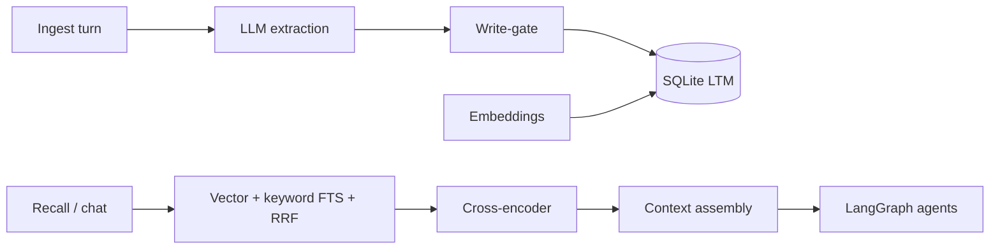

# AthleteCore Backend

FastAPI-сервис: **долгосрочная память (LTM)** + **LangGraph** (STM + мульти-агентный чат).

Подробная продуктовая модель памяти — в [`MEMORY_ARCHITECTURE.md`](../MEMORY_ARCHITECTURE.md).

---

## Как мы исследовали memory

### Проблема

Для AthleteCore недостаточно «длинного контекста» в одном чате. Нужно:

- помнить **повторяющиеся ошибки** конкретного спортсмена;
- не заставлять заново объяснять цели, травмы, предпочтения по времени тренировок;
- давать **объяснимые** рекомендации Analyst («на основе каких прошлых событий»);
- учитывать **HITL** (подтверждение/отклонение плана) как обучающий сигнал.

### Что сравнивали

| Подход | Плюсы | Почему не взяли как единственное решение |
|--------|-------|------------------------------------------|
| **Только STM** (история сообщений в промпте / checkpointer) | Просто | Дорого по токенам, «забывает» между сессиями, нет структуры |
| **Сырой RAG** (весь чат в векторную БД) | Быстро внедрить | Шум, слабое обновление фактов, плохо для «сменил цель / травма прошла» |
| **Mem0 / Zep и др. memory SDK** | Готовый API | Меньше контроля над спортивной схемой, supersession, eval под наш домен |
| **LangGraph Store only** | Нативно с графом | Хорошо для STM; LTM для персональных фактов и episodic всё равно нужно проектировать |
| **Граф знаний** | Сильные связи | Избыточная сложность для MVP и демо |

### Вывод исследования

Оптимально для AthleteCore — **гибрид**:

1. **STM** — LangGraph checkpointer (`thread_id`): текущий диалог, состояние графа, HITL interrupt.
2. **LTM** — отдельный контур: **извлечение структуры** → **хранение** → **гибридный recall** → **сборка контекста** с лимитом токенов.

Это не «чат-лог», а **memory bank** с типами, ключами и цепочками обновления.

---

## Почему выбран такой стек memory

### 1. LLM extraction (не raw chunks)

После каждого turn (`/turns` или `/api/chat`) модель (**gpt-4o-mini**, JSON, temperature 0.1) возвращает записи:

- `type`: fact | preference | opinion | event  
- `key`: стабильный dotted-id (`training.preference.time`, `performance.error.pattern`, …)  
- `value`, `confidence`, флаги supersession / risk / HITL  

**Зачем:** eval и продукт требуют **структурированных** воспоминаний, а не кусков диалога. Так проще персонализация Analyst и аудит на защите.

### 2. Supersession (эволюция фактов)

При том же `key` старые строки → `active=false`, новая ссылается на `supersedes_id`.

**Зачем:** спортсмен меняет цели, нагрузку, статус травмы — нельзя хранить противоречащие «активные» факты.

### 3. Embeddings + гибридный retrieval

- **Dense:** `text-embedding-3-small` (1536d) — семантика, перефразы.  
- **Lexical:** keyword FTS по `key` + `value` — имена, тактические термины, которые embedding может недотянуть.  
- **Fusion:** Reciprocal Rank Fusion (k=60).  
- **Rerank:** `cross-encoder/ms-marco-MiniLM-L-6-v2` (можно отключить `DISABLE_RERANKER=1`).

**Зачем:** в исследовании и на практике **vanilla cosine top-k** даёт слабый recall на смешанных запросах; hybrid + rerank стабильно лучше.

### 4. Recall gating (шум)

Если max cosine(query, memories) ниже порога (`RECALL_STABLE_MIN_COS`, `RECALL_RANKED_MIN_COS`, по умолчанию 0.2) — не подмешиваем нерелевантный профиль.

**Зачем:** off-topic вопрос не должен тащить весь профиль спортсмена в промпт.

### 5. Context assembly (tiktoken)

Секции с приоритетом при нехватке `max_tokens`:

1. Стабильный профиль (semantic)  
2. Правила взаимодействия (procedural)  
3. Релевантные матчи/тренировки (episodic + ranked)  
4. Недавние реплики сессии  

**Зачем:** предсказуемый бюджет для LangGraph-агентов; сначала то, что влияет на решение.

### 6. Write-gate

Пишем в LTM только ценное: HITL, повтор паттерна, MED/HIGH risk, core events, важные ключи.

**Зачем:** без gate память деградирует от small talk и дублей (см. риски в `MEMORY_ARCHITECTURE.md`).

### 7. Хранилище (MVP vs prod)

| Слой | MVP (сейчас) | Production (ТЗ) |
|------|----------------|-----------------|
| Turns + memories | **SQLite** + JSON embeddings | Postgres + pgvector или Qdrant `user_history` |
| Методология (RAG) | отдельный этап | **Qdrant** `sports_methodology` |
| STM графа | `graph_checkpoints.sqlite` | тот же паттерн |

SQLite выбран для демо: один файл, без Docker Postgres, та же логика пайплайна. Миграция — смена `DATABASE_URL` и vector backend, не переписывание extraction/recall.

### 8. Слои AthleteCore поверх extraction

| Извлечённый тип | Слой LTM | Пример |
|-----------------|----------|--------|
| fact, preference | semantic | время тренировки, цель сезона |
| event, match/training keys | episodic | лог матча, паттерн ошибки |
| agent.*, hitl.* | procedural | стиль ответа, строгость подтверждения плана |

---

## Архитектура memory (пайплайн)



---

## LangGraph (оркестрация)

```
START → planner (needs_memory?) → [load_memory | skip] → specialist → aggregator → END
```

Planner решает, нужен ли LTM: погода / перенос одного события в календаре → **без памяти**; анализ матча, план недели с нагрузкой → **с памятью**.

- **STM:** checkpointer по `thread_id`  
- **LTM:** recall перед специалистом; после ответа — cold-path ingest  
- **LLM:** LiteLLM (OpenAI + Anthropic)

---

## Запуск

```bash
cd backend
pip install -r requirements.txt
copy .env.example .env
# OPENAI_API_KEY=... (обязательно)
# ANTHROPIC_API_KEY=... (желательно для Analyst)
uvicorn app.main:app --reload --port 8001
```

- http://127.0.0.1:8001/docs

На Windows, если порт **8000** занят (`WinError 10013`), используй **8001** и в `frontend/.env` задай `VITE_API_PROXY_TARGET=http://127.0.0.1:8001` (уже в `.env.example`).  
- **POST /api/chat** — чат с фронта  
- **POST /turns**, **POST /recall**, **POST /search** — memory API  

Фронт: `frontend` → `npm run dev`, страница «Анализ».

## Тесты

```bash
set SKIP_DB_INIT=1
pytest tests/ -q
```

## Известные tradeoffs (честно)

- **Key drift:** LLM может назвать один факт разными `key` — supersession не склеит автоматически; нужна нормализация ключей (future work).  
- **Latency:** extraction + embedding + rerank на каждый turn; для dev — `DISABLE_RERANKER=1`.  
- **Язык:** промпты заточены под русский/английский микс спортивного домена.  

## Голосовой лог (Whisper)

`POST /api/transcribe` — `multipart/form-data`, поле `audio` (webm с браузера).  
Ответ: `{ "text", "duration_sec", "language" }`. На фронте 🎙 → транскрипт → `/api/chat`.

## MCP Server + Skill (курс)

- **MCP:** `mcp_server/server.py` — 4 tools (memory, methodology, calendar, propose block). См. `mcp_server/README.md`, Cursor: `.cursor/mcp.json`
- **Skill:** `.agents/skills/athletecore/SKILL.md` — домен, триггеры, workflows
- Analyst/Scheduler в LangGraph автоматически используют `app/mcp_tools/`

## Дальше

- Qdrant RAG (`user_history` + `sports_methodology`) вместо lexical-only methodology search  
- HITL UI на фронте для `pending_confirmation` событий  
